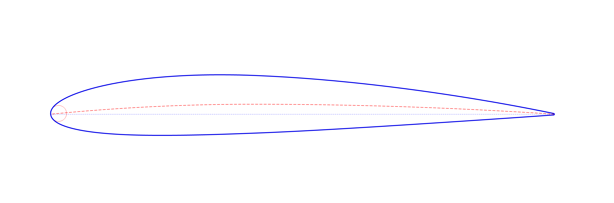
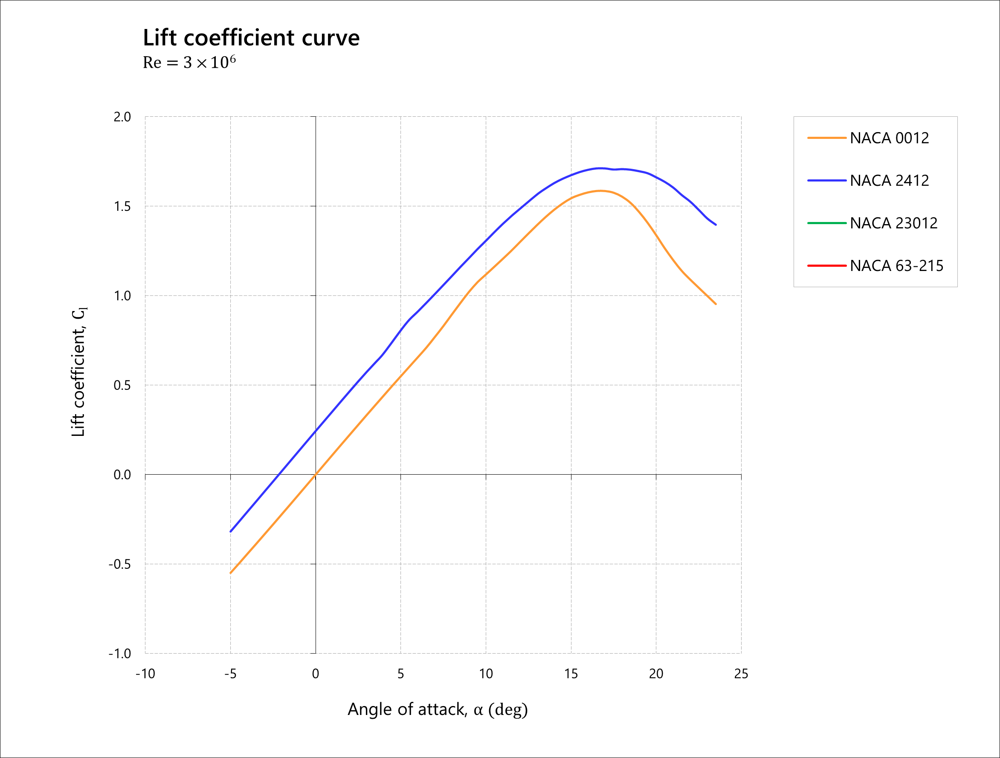
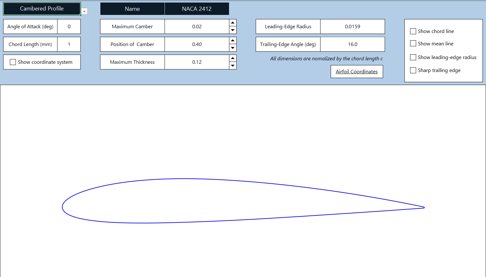

# Classical NACA Airfoil Modeling and Aerodynamic Analysis Framework


<p align="center">



</p>

<p align="center">

*Example airfoil geometry generated from the spreadsheet-based simulation model*

</p>

## Overview

This project investigates the geometric evolution of classical NACA airfoil families through a spreadsheet-based parametric modeling framework.

The tool reconstructs 2D airfoil geometries across multiple NACA series, enabling real-time geometric visualization, coordinate generation, geometric transformation, and preliminary aerodynamic workflow integration. Generated datasets can be exported for use in CAD systems and aerodynamic analysis tools such as XFOIL and XFLR5.

Beyond reproducing analytical airfoil equations, the project explores how classical aerodynamic theory is translated into engineering-ready geometry and computational aerodynamic workflows.

## Project Objectives

* Implement classical analytical formulations for multiple NACA airfoil families

* Develop a parametric spreadsheet-based framework for airfoil reconstruction

* Investigate how geometric parameters influence airfoil geometry, pressure distribution, and aerodynamic behavior

* Generate engineering-ready coordinate datasets for CAD and aerodynamic analysis workflows

* Provide an educational framework linking aerodynamic theory with practical geometric implementation


## Features of the Spreadsheet-Based Framework

The NACA airfoil modeling framework includes:

* Parametric airfoil generation across multiple NACA series

* Real-time visualization of upper and lower airfoil surfaces

* Mean camber line representation

* Chord scaling for engineering dimensions

* Angle-of-attack transformation using 2D coordinate rotation

* Exportable coordinate datasets for CAD and aerodynamic analysis tools

* Optional sharp trailing-edge reformulation for aerodynamic analysis compatibility

* Closed trailing-edge geometry generation for CAD integration and aerodynamic preprocessing workflows

In addition, the aerodynamic analysis visualization framework includes:

* Interactive aerodynamic analysis visualization through dynamic charts

* Toggle-based comparison of aerodynamic datasets using checkbox controls

* Comparative visualization of aerodynamic characteristics among representative NACA airfoils


## Repository Structure

```text

NACA-Airfoil-Geometry-and-Aerodynamic-Analysis-Framework/

│
├── naca_airfoil_modeling_framework.xlsm					# Spreadsheet-based parametric airfoil modeling framework
│
├── aerodynamic_analysis_of_selected_representative_naca_airfoils.xlsm		# Interactive aerodynamic analysis and comparison framework
│
├── readme_figures/       							# Illustrations used in the README
│
├── evolution_of_classical_naca_airfoil_families.pdf            		# Final compiled study report
│
└── README.md             							# Project documentation

```

## Methodology

Airfoil geometries are generated using classical analytical formulations for NACA 4- and 5-digit families, including modified series. For airfoils without simple closed-form geometric formulations, such as the NACA 6-series, standardized coordinate datasets are incorporated through a data-driven approach.

The framework computes thickness distributions, mean camber lines, upper and lower surface coordinates, and geometric transformations within an interactive computational environment implemented in Microsoft Excel. Additional preprocessing options, including trailing-edge closure and sharp trailing-edge reformulation, are implemented to improve compatibility with aerodynamic analysis workflows.

## Aerodynamic Analysis Visualization

To support comparative aerodynamic interpretation, an additional VBA-enabled spreadsheet framework (`aerodynamic_analysis_of_selected_representative_naca_airfoils.xlsm`) was developed for selected representative NACA airfoils.

The framework transforms aerodynamic analysis datasets into interactive aerodynamic charts, enabling users to selectively display or hide aerodynamic data series through checkbox-based controls. This allows clearer comparison of aerodynamic characteristics among representative airfoil families while improving visual clarity and exploratory analysis capability.

The implementation is intended to support preliminary aerodynamic interpretation and comparative analysis workflows within an accessible spreadsheet-based environment.


<p align="center">



</p>


<p align="center">

*Example lift-coefficient comparison between NACA 0012 and NACA 2412 generated using the aerodynamic visualization framework*

</p>


## Key Insight

This project highlights the transition of classical airfoil design from purely geometric parameterization toward increasingly aerodynamically informed design methodologies.

Working directly with airfoil reconstruction, coordinate generation, and geometric preprocessing provided insight into how airfoil geometry influences aerodynamic behavior, numerical representation, and engineering integration within practical aerodynamic design workflows.

## Simulation File

- `naca_airfoil_modeling_framework.xlsm`
  Spreadsheet-based parametric airfoil modeling framework


## How to Use

This framework is designed to be plug-and-play, requiring no installation other than Microsoft Excel. To better understand the airfoil design parameters and underlying aerodynamic concepts, refer to Section 2 ("Theory of NACA Airfoil Families") in `evolution_of_classical_naca_airfoil_families.pdf`.

### 1. Basic Configuration

1. Open the Workbook: Launch `naca_airfoil_modeling_framework.xlsm` in Microsoft Excel (The framework is optimized for Microsoft Excel 365). Ensure that VBA macros are enabled.

2. Select Airfoil Family: Navigate to the specific sheet for the series you wish to simulate (e.g., NACA 4-Digit, NACA 16-Series).

3. Input Parameters: Locate the Control Area.

* Modify the geometric design parameters using spin-button controls (e.g., for NACA 2412: \(m=0.02\), \(p=0.4\), \(t=0.12\)).

* Access lists for airfoil selections:
 - NACA 4-digit and NACA 4-digit modified: Type of airfoil (cambered or symmetrical)
 - NACA 5-digit: Mean-line designation (210, 220, etc.)
 - NACA 6-series: Series (63, 64, etc.)  

### 2. Engineering Scaling & Orientation

To prepare the geometry for CAD integration, use the Global Settings panel: 

* Chord Length (c): Enter your desired length in mm (e.g., 150).

* Angle of Attack ($\alpha$): Enter the pitch angle in degrees (e.g., 5).

* The airfoil coordinates are automatically scaled and rotated using a two-dimensional geometric transformation matrix.

### 3. Exporting Data for CAD/CFD

1. Verify Points: The tool generates a 100-point distribution by default, optimized using increased point density near the leading edge to improve geometric resolution in regions of high curvature.

2. Copy Coordinates:

* Select the generated X-Y coordinate columns.

* Copy and paste them into a .txt or .csv file.

3. Import to CAD:

* SolidWorks: Use Curve Through XYZ Points.

* CATIA: Use the GSD workbench or a macro to import point clouds.

* AutoCAD: Use the PLINE command by pasting the coordinates directly into the command line.


### Output

The model generates engineering-ready airfoil coordinate datasets and visualizes reconstructed airfoil geometries through dynamic charts and real-time parametric updates.

### Example Interface

<p align="center">

</p>

<p align="center">
<em>Example interface of the simulation model for the NACA 4-digit airfoil family</em>
</p>


## Applications

This project is intended for educational, exploratory, and preliminary engineering applications, including:

* Airfoil geometry reconstruction and analysis

* Visualization of aerodynamic behavior through parametric airfoil geometry

* Preliminary CAD integration workflows

* Preliminary aerodynamic analysis using XFOIL and XFLR5

* Aerospace engineering education and research-oriented study

* Comparative visualization and interpretation of aerodynamic datasets


## Possible Extensions

Potential future developments include:

* Integration with higher-fidelity aerodynamic analysis tools and CFD workflows

* Automated evaluation of lift, drag, pitching moment, and pressure distribution

* Python-based interactive visualization, preprocessing, and aerodynamic analysis environment

* Inverse airfoil design and optimization capabilities

* Extension toward three-dimensional wing and lifting-surface geometry generation


## Author

**Nghia T. Tran**

Physics student pursuing research interests in aerospace engineering, aerodynamics, airfoil design, and computational modeling methodologies.

GitHub: [@trungnghiatranaero](https://github.com/trungnghiatranaero)


## License

This project is released under the MIT License.
